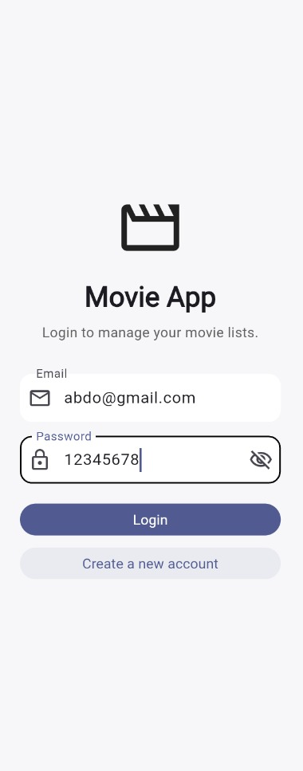
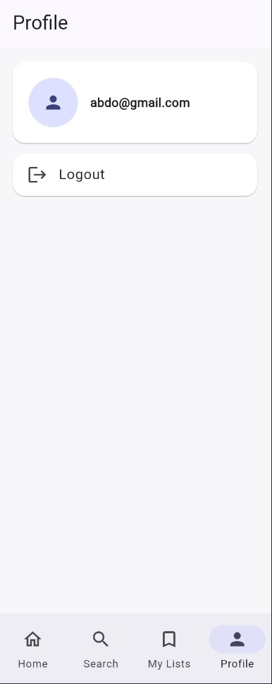
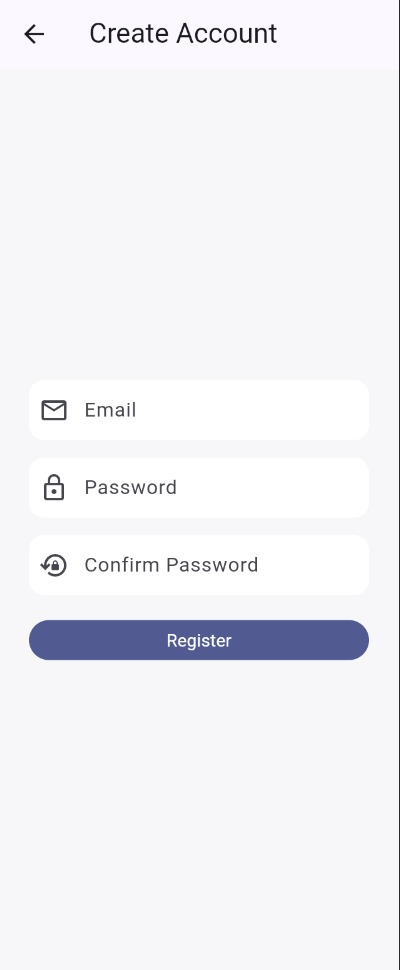
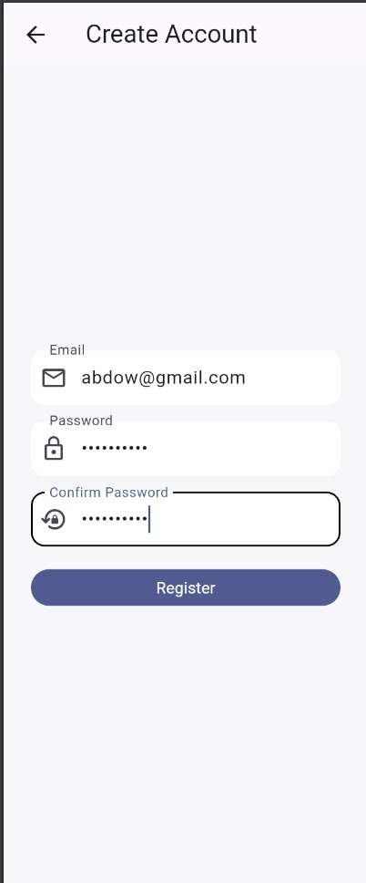
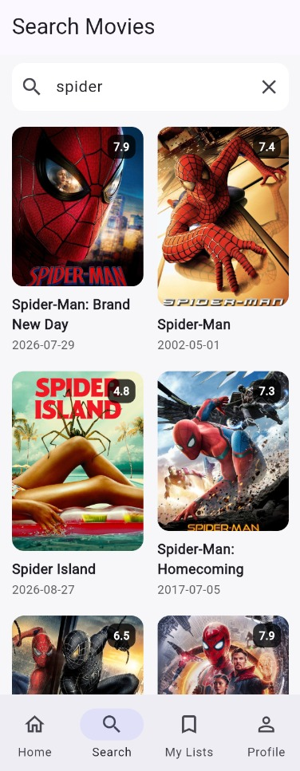
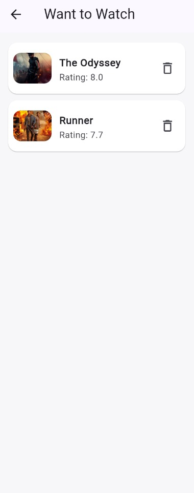
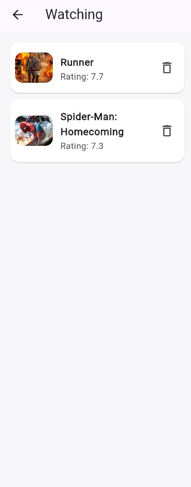

# ITI Flutter Graduation Project 2026 - Movie App

Simple Flutter movie application built to match the official ITI Summer Internship 2026 graduation-project specification.

## Screenshots

### Home


### Login


### Profile


### Register


### Register 2


### Search


### Want to Watch


### Watching


## What is included

- Flutter + Dart application
- TMDB API integration
- REST requests + JSON models
- Firebase Authentication: Register, Login, Logout, auth-state handling
- MVVM-style structure using ChangeNotifier + Provider
- Cloud Firestore database
- Four persistent user lists: Favorites, Watched, Watching, Want to Watch
- Home sections: Trending, Popular, Now Playing, Top Rated, Upcoming
- Movie Details screen with list add/remove actions
- Search with a short debounce to reduce unnecessary requests
- Loading, error, and empty states
- Firestore security rules per authenticated user
- README and a simple project structure that is easy to explain in a discussion

## Important setup

This folder contains the application source code. Flutter platform folders and the real Firebase configuration are intentionally not hard-coded because they depend on the Firebase project used for submission.

### 1. Create the Flutter platform files

Run inside the project folder:

```bash
flutter create . --platforms=android
```

You can add iOS/web later if you need them.

### 2. Get packages

```bash
flutter pub get
```

The dependency versions in `pubspec.yaml` were selected from the current stable package versions available when this project was prepared. The Firebase packages require Dart 3.6+ and therefore are compatible with a Dart 3.13 environment.

### 3. Configure Firebase

Install/login to Firebase and FlutterFire CLI if you have not already done so, then run:

```bash
dart pub global activate flutterfire_cli
firebase login
flutterfire configure
```

Select your Firebase project and Android app. The command will regenerate `lib/firebase_options.dart` with your real configuration.

In Firebase Console:

1. Enable Authentication -> Sign-in method -> Email/Password.
2. Create a Firestore Database.
3. Deploy the supplied security rules if needed:

```bash
firebase deploy --only firestore:rules
```

### 4. Add a TMDB API key

Create a TMDB API key, then run the app with:

```bash
flutter run --dart-define=TMDB_API_KEY=YOUR_TMDB_API_KEY
```

Do not put the key directly in the Dart source or public GitHub repository.

## Architecture

The project uses a small MVVM-style structure:

```text
lib/
├── core/
│   ├── config/          # runtime configuration
│   ├── constants/       # fixed API URLs
│   └── theme/           # app theme
├── models/              # Movie and list types
├── repositories/        # movie data entry point
├── services/            # TMDB, Firebase Auth, Firestore
├── viewmodels/          # application state + business logic
├── widgets/             # reusable UI widgets
├── screens/             # application screens
├── firebase_options.dart
└── main.dart
```

### Data flow for TMDB

```text
Screen -> ViewModel -> MovieRepository -> TmdbService -> TMDB API
       <- ViewModel <- MovieRepository <- TmdbService <- JSON -> Movie model
```

### Data flow for user lists

```text
Movie Details Screen
        ↓
MovieDetailsViewModel
        ↓
FirestoreService
        ↓
users/{uid}/lists/{list}/movies/{movieId}
```

This makes it easy to explain why the UI does not directly call TMDB or Firestore.

## Firestore structure

Each authenticated user has four list collections:

```text
users
└── {uid}
    └── lists
        ├── favorites
        │   └── movies
        ├── watched
        │   └── movies
        ├── watching
        │   └── movies
        └── want_to_watch
            └── movies
```

Each movie document stores the basic TMDB movie information needed to render the list without calling TMDB again.

## Technical discussion notes

### Why Provider?

The project uses `ChangeNotifier` because it is straightforward for a beginner/intermediate Flutter project. A ViewModel changes state, calls `notifyListeners()`, and widgets listening with Provider rebuild.

### Why this architecture?

It separates responsibilities without creating a large Clean Architecture project that would be harder to study before the discussion:

- Models: represent data.
- Services: talk to external systems.
- Repository: gives the UI layer a simple movie-data API.
- ViewModels: hold state and application logic.
- Screens/widgets: display state and react to user actions.

### How authentication state works

`AuthService` exposes Firebase's `authStateChanges()` stream. `AuthViewModel` listens to it. `AuthGate` chooses the Splash, Login, or main application UI depending on the current authentication state.

### Search debounce

The search ViewModel waits 500 milliseconds after the last text change before sending the request. This reduces unnecessary API calls while typing.

## Required specification coverage

The official brief requires TMDB, Firebase Authentication, architecture/design pattern, state management, all four movie lists, a database, GitHub, documentation, persistent data, and loading/error handling. This project source contains those application parts. Figma is optional in the official brief and is not required for the implementation.

## Suggested commit history

Create several meaningful commits instead of one final upload. Example:

```text
init flutter project
add firebase authentication
add tmdb models and service
add home movie lists
add movie details
add firestore movie lists
add search screen
add error and empty states
update documentation
```

## Before submission

Test these manually:

- Registration
- Login
- Logout
- Home movie loading
- Movie details
- Search + no results
- Add/remove Favorites
- Add/remove Watched
- Add/remove Watching
- Add/remove Want to Watch
- Restart the app and verify the lists are still there
- Turn off internet and verify an error state appears
- Verify Firebase rules block access to another user's data
- Verify the GitHub repository has meaningful history and no secrets
